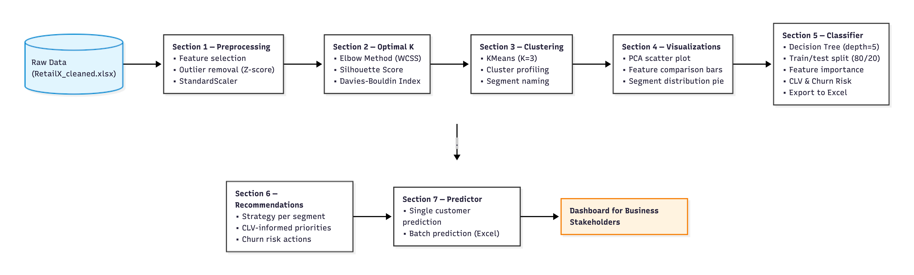

# 🛍️ RetailX Customer Segmentation

> Unsupervised machine learning pipeline to discover customer behavioural groups and automate segment prediction for new customers.


---
---

## Table of Contents

- [Executive Summary](#executive-summary)
- [Business Problem](#business-problem)
- [Project Architecture](#project-architecture)
- [Project Structure](#project-structure)
- [Methodology](#methodology)
- [Skills & Tools](#skills--tools)
- [Key Results & Business Recommendations](#key-results--business-recommendations)
- [Dashboard Preview](#dashboard-preview)
- [Next Steps & Limitations](#next-steps--limitations)
- [How to Run](#how-to-run)

---

## Executive Summary

RetailX is a retail company with ~2,000 customers across varying income levels, purchase behaviours, and engagement patterns. This project applies **K-Means clustering** to segment customers into three distinct groups based on seven behavioural features — then trains a **Decision Tree classifier** to automatically assign new customers to a segment at scale.

The result is a reusable ML pipeline that outputs:
- Named customer segments with CLV and churn risk scores
- A batch predictor for new customer files
- An interactive Streamlit dashboard for business teams

**K=3 was selected** as the optimal number of clusters based on the Elbow method, Silhouette score, Davies-Bouldin index, and business interpretability.

---

## Business Problem

RetailX currently treats all customers the same — sending identical marketing campaigns regardless of spending behaviour, tenure, or engagement level. This leads to:

- Over-marketing to loyal customers who buy consistently without prompting
- Under-engaging new customers who need activation to make repeat purchases
- Wasted marketing budget on low-response segments

**Goal:** Discover natural customer groups from behavioural data and build a system that assigns new customers to the right segment automatically — enabling targeted, data-driven marketing strategies.

---

## Project Architecture


## Project Structure


---

## Methodology

### 1. Feature Selection
Started with 16 columns. Dropped identifiers (`Cust_No`, `zip_code`), near-zero variance features (`per_sale`), redundant features (`loyalty_card` — correlated 0.73 with crossbuy), and noise features (`return_rate`). Retained 7 behavioural features:

| Feature | Description |
|---|---|
| `avg_order_size` | Average spend per order ($) |
| `avg_order_freq` | Average orders per month |
| `crossbuy` | Number of product categories purchased |
| `multichannel` | Number of channels used (1–3) |
| `tenure` | Years as a customer |
| `income` | Annual income (thousands $) |
| `avg_mktg_cnt` | Average marketing contacts received |

### 2. Preprocessing
- **Outlier removal** using Z-score method (threshold = 3σ) — KMeans is sensitive to extreme values
- **StandardScaler** normalization — ensures all features contribute equally to Euclidean distance

### 3. Choosing K
Three methods were used together:

| Method | Best K | Notes |
|---|---|---|
| Elbow (WCSS) | ~3 | Curve flattens noticeably after K=3 |
| Silhouette Score | K=2 (0.2511) | K=3 close behind at 0.2257 |
| Davies-Bouldin | K=7 (1.3571) | Improvement from K=3 (1.5534) is marginal |

**K=3 selected** — best tradeoff between statistical scores and business interpretability. Silhouette scores in retail CRM data are typically low (0.1–0.3) due to naturally overlapping customer behaviour.

### 4. Segment Naming
Clusters were named by inspecting mean/median feature profiles:

| Cluster | Segment Name | Key Characteristic |
|---|---|---|
| 0 | Loyal High-Income Customers | Highest income ($103k), longest tenure (32 yrs) |
| 1 | Engaged Active Shoppers | Highest frequency (3.25/mo), highest CLV ($1,499) |
| 2 | New Low-Engagement Customers | Lowest frequency (0.67/mo), shortest tenure (7.78 yrs) |

### 5. Decision Tree Classifier
- Trained on cluster labels produced by KMeans (unsupervised → supervised pipeline)
- `max_depth=5` selected by plotting train vs test accuracy across depths 1–14
- Stratified 80/20 train/test split

### 6. Business Metrics Added
- **CLV** = `avg_order_size × avg_order_freq × tenure`
- **Churn Risk** = High if `avg_order_freq < median` AND `return_rate > median`

---

## Skills & Tools

| Category | Tools |
|---|---|
| Language | Python 3.10+ |
| Data manipulation | pandas, numpy |
| Machine learning | scikit-learn (KMeans, DecisionTreeClassifier, StandardScaler, PCA) |
| Visualisation | matplotlib, seaborn, plotly |
| Dashboard | Streamlit |
| Statistical analysis | scipy (Z-score outlier detection) |
| Data export | openpyxl |
| Environment | Jupyter Notebook |

---

## Key Results & Business Recommendations

### Segment Results

| Segment | Count | Avg CLV | Churn Risk | Priority |
|---|---|---|---|---|
| Loyal High-Income Customers | 396 | $1,068 | 20.71% ⚠️ | High |
| Engaged Active Shoppers | 437 | $1,499 | 1.83% ✅ | High |
| New Low-Engagement Customers | 1,064 | $143 | 17.29% ⚠️ | Highest |

### Key Insights

**1. CLV vs Income paradox** — Loyal High-Income customers earn the most ($103k) but generate less lifetime value ($1,068) than Engaged Active Shoppers ($1,499) due to low purchase frequency. Frequency drives value, not income.

**2. Hidden churn warning** — Despite 32 years of average tenure, 20.71% of Loyal High-Income customers are at high churn risk. Long tenure does not mean safe.

**3. The activation opportunity** — 56% of the customer base (1,064 customers) are low-engagement with an average CLV of only $143 — 10× lower than Engaged Shoppers. Even a small improvement in their order frequency would generate significant incremental revenue.

### Marketing Strategies

| Segment | Strategy | Key Actions |
|---|---|---|
| Loyal High-Income | Retention & Exclusivity | VIP rewards, minimal contact, milestone messages |
| Engaged Active Shoppers | Upsell & Cross-sell | Bundle deals, multichannel campaigns, tiered loyalty |
| New Low-Engagement | Activation & Onboarding | Welcome series, first-purchase discounts, single channel |

---

## Next Steps & Limitations

### Limitations
- **No date column** in the dataset — RFM (Recency, Frequency, Monetary) analysis was not possible as Recency could not be calculated
- **Silhouette scores are low (0.19–0.25)** — typical for retail CRM data where customer behaviour overlaps naturally. Clusters are valid but boundaries are soft
- **CLV is estimated** using a simple formula (order size × frequency × tenure) — not based on actual transaction history
- **Churn Risk is rule-based** — defined by low frequency + high return rate, not a trained churn prediction model

### Potential Next Steps
- Add a proper churn prediction model (Logistic Regression or Random Forest) trained on labelled churn data
- Collect transaction dates to enable true RFM analysis and Recency scoring
- Deploy the Streamlit dashboard publicly via Streamlit Cloud
- Re-run segmentation periodically as customer behaviour evolves over time
- Test Gaussian Mixture Models (GMM) as an alternative to KMeans for soft cluster boundaries

---
## How to Run

### Requirements
```bash
pip install -r requirements.txt
```

Or install manually:
```bash
pip install pandas numpy scikit-learn matplotlib seaborn 
```

### Run the Notebook
1. Place `RetailX_cleaned.xlsx` in the project root folder
2. Open `Customer_Segmentation_Project.ipynb` in Jupyter or VS Code
3. Run all cells top to bottom (**Kernel → Restart & Run All**)
4. Outputs will be saved automatically:
   - `RetailX_segmented.xlsx` — full segmented dataset
   - `RetailX_new_customers_segmented.xlsx` — batch prediction results (if `new_customers.xlsx` is present)

